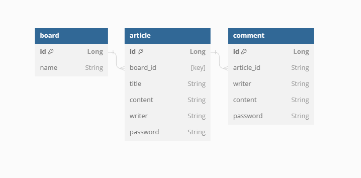

#  Misson_Jungyujin

## 익명 의견 교환 게시판
사용자들이 자기 자신의 정보를 드러낼 필요 없이 의견을 교환할 수 있는 웹페이지입니다.

단, 자신이 누군지를 드러낼 필요는 없지만 작성한 사람이 원한다면 수정 ∙ 삭제는 가능합니다!

#  📍 ERD

#  📍 주요 기능

## 필수 과제
### 1. 게시판 조회 기능 ( Board )
- 전체 게시글을 위한 전체 게시판
    - 조회되는 게시글들은 항상 나중에 작성된 게시글이 최상단에 작성
- 게시판 글 제목 조회하면 단일 게시물 조회
- 게시판 종류 : 자유 / 개발 / 일상 / 사건 사고 게시판

### 2. 게시글 작성 기능 ( Article )
- 제목 , 내용 작성
    - 어떤 게시판에 작성할 지를 선택
    - 게시글을 작성할때는 작성자가 자신임을 증명할 수 있는 비밀번호를 추가해서 작성

### 3. 게시글 조회 및 수정 / 삭제 기능
- 조회
- 수정
    - 게시글을 수정하는 페이지에는, 게시글의 본래 제목, 글이 존재
    - 게시글 수정을 위해 비밀번호를 제출
        - 입력하는 비밀번호가 게시글 작성 당시의 비밀번호와 일치해야 수정
- 삭제
    - 단일 게시글 조회 페이지에 있는 삭제를 위한 UI를 이용해 삭제
    - 게시글 삭제를 위해 비밀번호를 제출
        - 입력하는 비밀번호가 게시글 작성 당시의 비밀번호와 일치해야 삭제

### 4. 댓글 기능 ( Comment )
- 단일 글 조회 페이지에서 댓글 작성
    - 댓글을 작성할때는 작성자가 자신임을 증명할 수 있는 비밀번호를 추가해서 작성
- 단일 글 조회 페이지에서 댓글 조회, 삭제
    - 댓글 삭제를 위해 비밀번호를 제출
        - 입력하는 비밀번호가 댓글 작성 당시의 비밀번호와 일치해야 삭제

#  📍 프로젝트 실행 / 테스트 

TEST

1. localhost:8080/boards에서 전체 게시판 조회
2. 각각 게시판으로 이동 후 작성 버튼 클릭하여 게시글 작성
3. 작성 후 게시판에서 게시글 게시 확인
4. 게시글 제목 클릭하여 게시글 상세조회 및 댓글 조회
5. 게시글 수정 -> 비밀번호와 수정할 내용 입력 후 수정
6. 게시글 삭제 -> 비밀번호 입력 후 삭제
7. 댓글 내용과 비밀번호 입력 후 댓글 작성
8. 댓글 삭제 -> 비밀번호 입력 후 삭제

#  📍 진행 중 발생한 어려움
- @GetMapping("경로") return "페이지 경로" 가 헷갈려서 처음엔 버벅거려서 왜 안띄워지는 건가 질문을 드렸고 금방 습득해서 프로젝트 진행했다.
- 비밀번호 입력하고 삭제 시  alert 창만 띄우고 삭제 하고 싶었는데 그러지 못해서 comment-delete.html 로 넘어갔다가 다시 돌아와야했다.
- 댓글 form 에서 입력해 DB에 저장은 됐으나 단일 글 조회 페이지에서 뜨지 않아서 한참 고민했는데 ... entity 에서 @OneToMany 하는 걸 까먹었다 .. (하루종일 걸렸다..)
